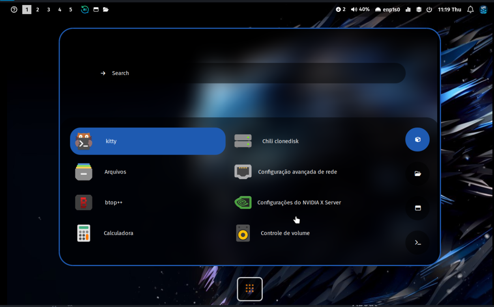

# comm-hyprland

**A complete Hyprland setup with custom configurations and keybindings.**  





## About  

`comm-hyprland` is a package that provides a fully configured **Hyprland** environment, including:  

- A **pre-configured** Hyprland setup  
- Essential **customizations** for an optimal workflow  
- Useful **keybindings** for better window management  

This package is designed for users who want a **ready-to-use Hyprland environment** with a smooth experience.

### Installation via `pacman`  

```sh
sudo pacman -Sy comm-hyprland
```

## Credits  

This project is inspired by the **[dotfiles](https://github.com/mylinuxforwork/dotfiles)** created by **Stephan Raabe**.  
A big thanks to **Stephan Raabe** for his amazing work and contributions to the Hyprland ecosystem!
